# [📈 Live Status](https://github.com/Status-Plus): <!--live status--> **🟩 All systems operational**

This repository contains the open-source uptime monitor and status page for [Status+](https://status-plus.github.io/StatusPlus/), powered by [Upptime](https://github.com/upptime/upptime).

<!--start: status pages-->
<!-- This summary is generated by Upptime (https://github.com/upptime/upptime) -->
<!-- Do not edit this manually, your changes will be overwritten -->
<!-- prettier-ignore -->
| URL | Status | History | Response Time | Uptime |
| --- | ------ | ------- | ------------- | ------ |
|  [Roblox Site](https://www.roblox.com) | 🟩 Up | [roblox-site.yml](https://github.com/Status-Plus/StatusPlus/commits/HEAD/history/roblox-site.yml) | 

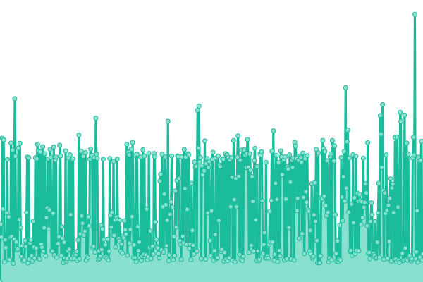 289ms
     
 | 

<a href="https://Status-Plus.github.io/StatusPlus/history/roblox-site">100.00%</a>
    

|  [Roblox Devforum](https://devforum.roblox.com) | 🟩 Up | [roblox-devforum.yml](https://github.com/Status-Plus/StatusPlus/commits/HEAD/history/roblox-devforum.yml) | 

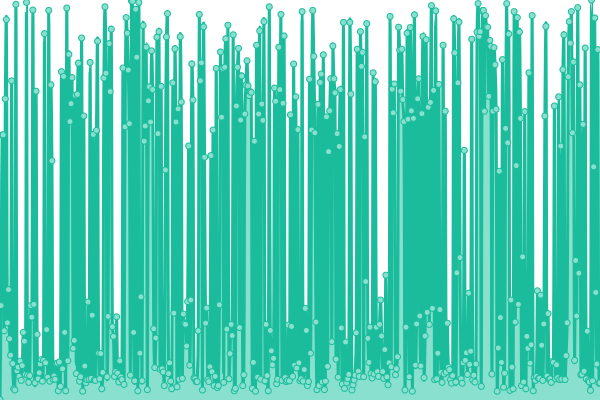 391ms
     
 | 

<a href="https://Status-Plus.github.io/StatusPlus/history/roblox-devforum">100.00%</a>
    

|  [Roblox Devhub](https://developer.roblox.com) | 🟩 Up | [roblox-devhub.yml](https://github.com/Status-Plus/StatusPlus/commits/HEAD/history/roblox-devhub.yml) | 

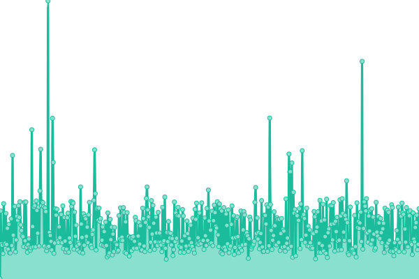 178ms
     
 | 

<a href="https://Status-Plus.github.io/StatusPlus/history/roblox-devhub">100.00%</a>
    

|  [Avatar API Endpoint](https://avatar.roblox.com/v1/avatar-rules) | 🟩 Up | [avatar-api-endpoint.yml](https://github.com/Status-Plus/StatusPlus/commits/HEAD/history/avatar-api-endpoint.yml) | 

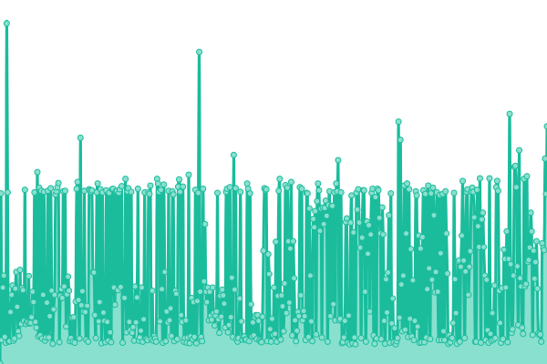 199ms
     
 | 

<a href="https://Status-Plus.github.io/StatusPlus/history/avatar-api-endpoint">99.84%</a>
    

|  [Badges API Endpoint](https://badges.roblox.com/v1/badges/2124548403) | 🟩 Up | [badges-api-endpoint.yml](https://github.com/Status-Plus/StatusPlus/commits/HEAD/history/badges-api-endpoint.yml) | 

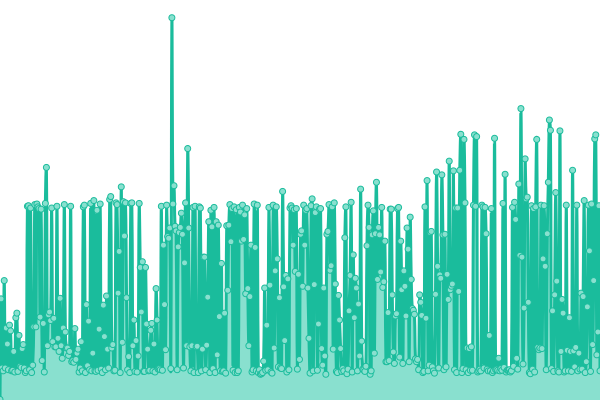 198ms
     
 | 

<a href="https://Status-Plus.github.io/StatusPlus/history/badges-api-endpoint">100.00%</a>
    

|  [Roblox's CDN API Endpoint](http://cdnproviders.roblox.com/) | 🟩 Up | [roblox-s-cdn-api-endpoint.yml](https://github.com/Status-Plus/StatusPlus/commits/HEAD/history/roblox-s-cdn-api-endpoint.yml) | 

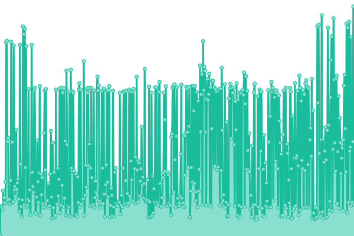 164ms
     
 | 

<a href="https://Status-Plus.github.io/StatusPlus/history/roblox-s-cdn-api-endpoint">100.00%</a>
    

|  [Catalog API Endpoint](https://catalog.roblox.com/v1/bundles/details?bundleIds=192) | 🟩 Up | [catalog-api-endpoint.yml](https://github.com/Status-Plus/StatusPlus/commits/HEAD/history/catalog-api-endpoint.yml) | 

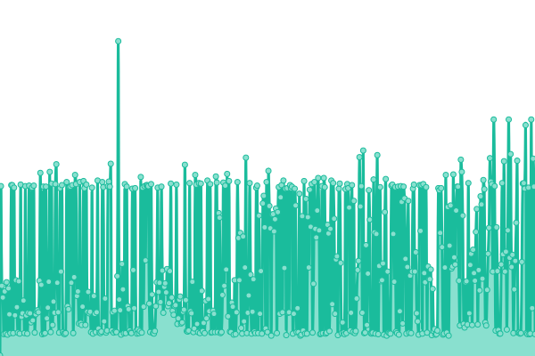 224ms
     
 | 

<a href="https://Status-Plus.github.io/StatusPlus/history/catalog-api-endpoint">99.97%</a>
    

|  [Economy API Endpoint](https://economy.roblox.com/) | 🟩 Up | [economy-api-endpoint.yml](https://github.com/Status-Plus/StatusPlus/commits/HEAD/history/economy-api-endpoint.yml) | 

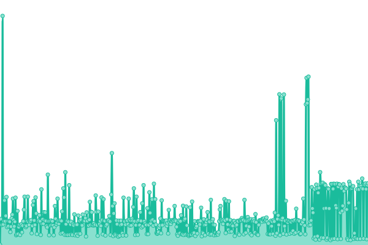 182ms
     
 | 

<a href="https://Status-Plus.github.io/StatusPlus/history/economy-api-endpoint">100.00%</a>
    

|  [Datastore API Endpoint](https://gamepersistence.roblox.com/) | 🟩 Up | [datastore-api-endpoint.yml](https://github.com/Status-Plus/StatusPlus/commits/HEAD/history/datastore-api-endpoint.yml) | 

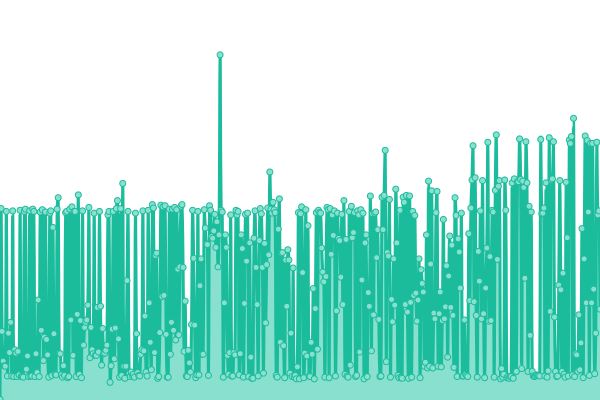 200ms
     
 | 

<a href="https://Status-Plus.github.io/StatusPlus/history/datastore-api-endpoint">100.00%</a>
    

|  [Develop API Endpoint](https://develop.roblox.com/v1/toolbox/items?category=Hat&keyword=Hat) | 🟩 Up | [develop-api-endpoint.yml](https://github.com/Status-Plus/StatusPlus/commits/HEAD/history/develop-api-endpoint.yml) | 

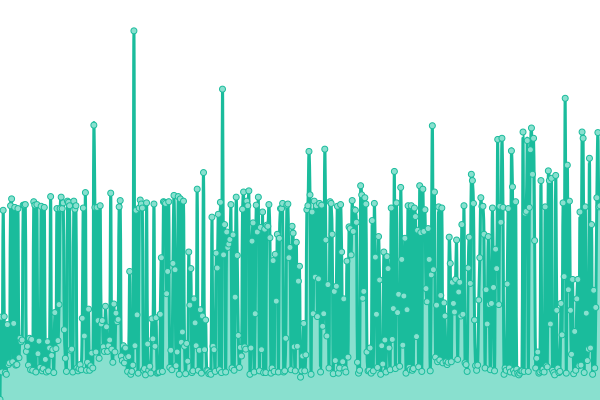 229ms
     
 | 

<a href="https://Status-Plus.github.io/StatusPlus/history/develop-api-endpoint">99.97%</a>
    

|  [Friends API Endpoint](https://friends.roblox.com/v1/metadata) | 🟩 Up | [friends-api-endpoint.yml](https://github.com/Status-Plus/StatusPlus/commits/HEAD/history/friends-api-endpoint.yml) | 

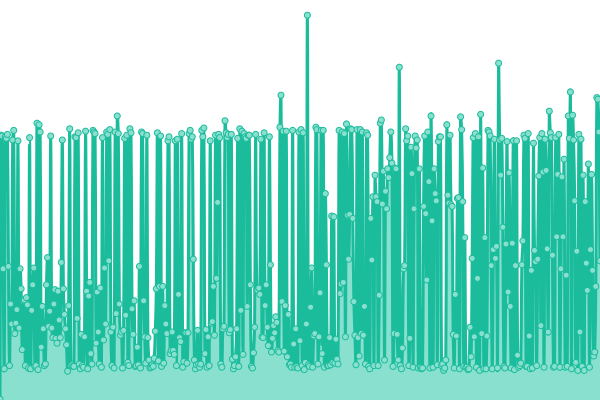 197ms
     
 | 

<a href="https://Status-Plus.github.io/StatusPlus/history/friends-api-endpoint">100.00%</a>
    

|  [Game Join API Endpoint](http://gamejoin.roblox.com/) | 🟩 Up | [game-join-api-endpoint.yml](https://github.com/Status-Plus/StatusPlus/commits/HEAD/history/game-join-api-endpoint.yml) | 

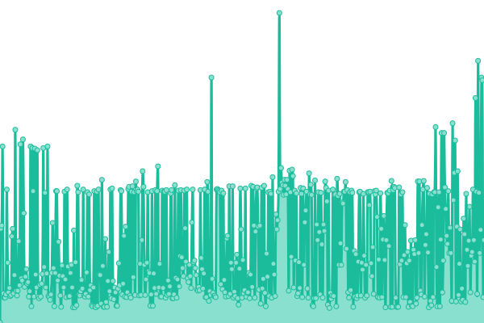 180ms
     
 | 

<a href="https://Status-Plus.github.io/StatusPlus/history/game-join-api-endpoint">100.00%</a>
    

|  [Game Internationalization API Endpoint](https://gameinternationalization.roblox.com/) | 🟩 Up | [game-internationalization-api-endpoint.yml](https://github.com/Status-Plus/StatusPlus/commits/HEAD/history/game-internationalization-api-endpoint.yml) | 

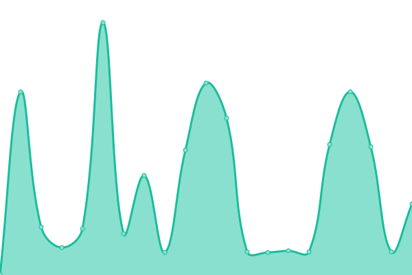 192ms
     
 | 

<a href="https://Status-Plus.github.io/StatusPlus/history/game-internationalization-api-endpoint">100.00%</a>
    

|  [Groups API Endpoint](https://groups.roblox.com/v1/groups/configuration/metadata) | 🟩 Up | [groups-api-endpoint.yml](https://github.com/Status-Plus/StatusPlus/commits/HEAD/history/groups-api-endpoint.yml) | 

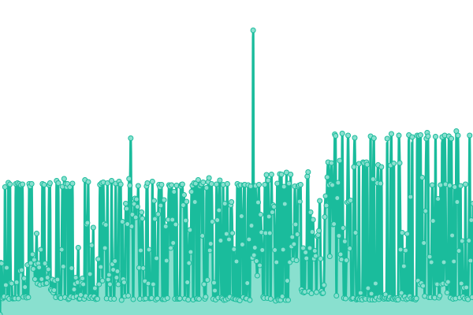 192ms
     
 | 

<a href="https://Status-Plus.github.io/StatusPlus/history/groups-api-endpoint">100.00%</a>
    

|  [Inventory API Endpoint](https://inventory.roblox.com/v1/users/82738847/assets/collectibles?limit=10&sortOrder=Asc) | 🟩 Up | [inventory-api-endpoint.yml](https://github.com/Status-Plus/StatusPlus/commits/HEAD/history/inventory-api-endpoint.yml) | 

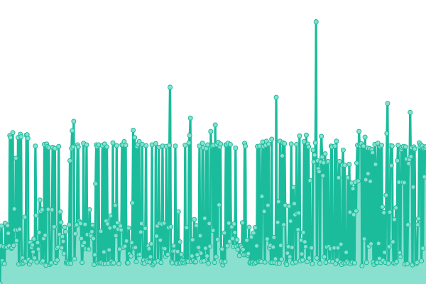 210ms
     
 | 

<a href="https://Status-Plus.github.io/StatusPlus/history/inventory-api-endpoint">100.00%</a>
    

|  [Text Filter API Endpoint](http://textfilter.roblox.com/) | 🟩 Up | [text-filter-api-endpoint.yml](https://github.com/Status-Plus/StatusPlus/commits/HEAD/history/text-filter-api-endpoint.yml) | 

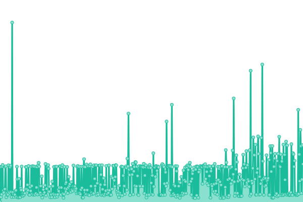 175ms
     
 | 

<a href="https://Status-Plus.github.io/StatusPlus/history/text-filter-api-endpoint">100.00%</a>
    

|  [Thumbnails API Endpoint](https://thumbnails.roblox.com/v1/assets?assetIds=82738847&format=Png&isCircular=false&size=30x30) | 🟩 Up | [thumbnails-api-endpoint.yml](https://github.com/Status-Plus/StatusPlus/commits/HEAD/history/thumbnails-api-endpoint.yml) | 

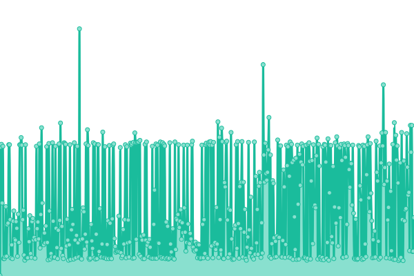 194ms
     
 | 

<a href="https://Status-Plus.github.io/StatusPlus/history/thumbnails-api-endpoint">100.00%</a>
    

<!--end: status pages-->

[**Visit our status website →**](https://status-plus.github.io/StatusPlus/)

## 📄 License

- Powered by: [Upptime](https://github.com/upptime/upptime)
- Code: [MIT](./LICENSE) © [Status+](https://github.com/Status-Plus)
- Data in the `./history` directory: [Open Database License](https://opendatacommons.org/licenses/odbl/1-0/)
